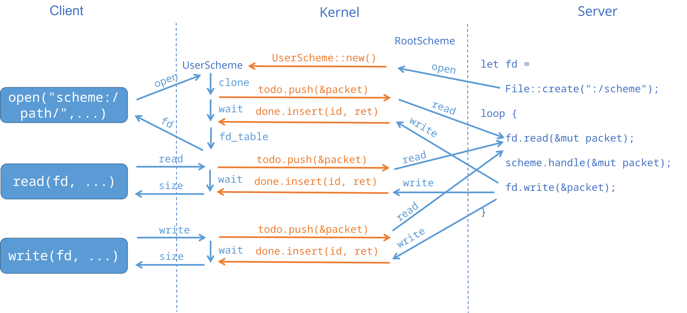

# Redox 的 IPC 机制

reference: 
+ https://doc.redox-os.org/book/ch05-00-urls-schemes-resources.html
+ https://gitlab.redox-os.org/redox-os/kernel

Redox 的 IPC 机制是通过重新定义文件 I/O 的方式进行。URL 为不同的服务提供了类似的访问接口——`scheme:/path`，`scheme` 类似互联网上的协议，对应了不同的系统服务；`path` 则对应了服务提供的不同接口（和参数）；同时文件访问的不同接口（`create`, `read`, `write`）等也可以所需实现的功能被赋予不同的含义

用户程序通过文件/socket 方式与各类外围模块进行通信，一个打开的 `scheme` 称为 `resources`。

## 一个例子

摘自 https://doc.redox-os.org/book/ch05-08-example.html

服务器的实现类似于一个 Web 服务器，采用轮询的方式读取并处理请求：

``` rust
fn main() {

    let mut scheme = VecScheme::new();

    let mut handler = File::create(":vec")
        .expect("Failed to create the vec scheme");

    let mut packet = Packet::default();

    loop {
        // Wait for the kernel to send us requests
        let read_bytes = handler.read(&mut packet)
            .expect("vec: failed to read event from vec scheme handler");

        if read_bytes == 0 {
            // Exit cleanly
            break;
        }

        // Scheme::handle passes off the info from the packet to the individual
        // scheme methods and writes back to it any information returned by
        // those methods.
        scheme.handle(&mut packet);

        handler.write(&packet)
            .expect("vec: failed to write response to vec scheme handler");
    }
}
```

值得注意的是，服务进程通过向根 Scheme `:` 发送 create 请求来注册一个服务，之后的数据包处理也是通过对这个「文件」的读写进行。

``` rust
fn main() {
    let mut vec_file = File::open("vec:/hi")
        .expect("Failed to open vec file");

    vec_file.write(b" Hello")
        .expect("Failed to write to vec:");

    let mut read_into = String::new();
    vec_file.read_to_string(&mut read_into)
        .expect("Failed to read from vec:");

    println!("{}", read_into); // olleH ih/
}
```

对应的，客户端的请求相应也以文件 I/O 的形式进行。

## 内部实现

为了辅助服务端开发，redox 采用 `Scheme` trait 来完成对 scheme 的封装和抽象，开发者只需要实现 trait 中的对应函数来完成对对应请求的处理。而至于请求的分发，包装则由 kernel 和 trait 框架共同处理。

在内核中也实现了大量的 scheme 来完成内核所需的功能，相应的，syscall 的数量也相应的减少，并主要集中到了文件 I/O 上（甚至它取消了 `fork/clone` 调用，由 scheme 来完成，详见 `ProcScheme`）。我们后面主要关心两个内核 scheme, `RootScheme` 和 `UserScheme`，它们提供了用户态 scheme 的创建、封装、转发工作。

一个文件相关系统调用在进入内核态后，在 `syscall` 模块会被预处理，解析出对应的 scheme，并转发给相应的 scheme 进行处理。

### 创建

在服务端创建 `:/<scheme>` 文件时，会转发给 `RootScheme`，`RootScheme` 目录下每一个「文件」对应着一个用户态的 scheme，这个文件的内部数据结构则指向了一个 `UserScheme`（严格来说，是其内部实现 `UserSchemeInner`），也就是这个 scheme 在内核中的抽象。

### 请求

对于客户端的任意请求（无论是打开，读写文件或者是目录操作），`UserScheme` 模块都会将其转发给对应的 `UserSchemeInner::write` 函数，在这里，请求将会被封装成数据包，并通过数据结构中的消息队列发送给 `RootScheme`，完成后，客户端对应的内核线程调用 `UserSchemeInner::read` 函数等待请求返回。

而在服务端，通过上述的轮询代码中的读请求进入内核，并进入 `RootScheme::read` 函数接收客户端发来的请求。`RootScheme` 根据文件描述符等信息确定对应的 `UserScheme` 并尝试从消息队列中读取信息，在完成必要的数据复制后返回用户态，服务端进入 `Scheme::handle`，在内部再根据数据包中的标注转发给不同的处理例程。

从这个过程来看，scheme 机制本身并不对 Scheme 内部的命名空间做出任何的假设，对命名空间内部的所有操作都由服务端程序本身来完成。

在服务器端完成处理过程后，调用文件写操作，调用 `RootScheme::write` 向对应的 `UserScheme` 发送回复报文，`UserScheme::read` 收到结果返回。



## 问题

+ 其它的微内核系统（如 seL4, ziricon）在实现 IPC 的同时解决了不同进程对不同资源的管理权限问题（如通过 IPC 对相关权限进行转发），在 redox 中是否实现了类似的机制？
+ redox 是如何通过 scheme 来实现 `fork/clone` 的？
  目前的发现：在内核端格式为 `proc:/<pid>/`，`pid = "new"` 时表示新建一个进程，它是如何被用户态调用的。可能需要查阅 redox 对 libc/Rust std 的移植。
+ redox 的机制是基于原本对于文件的抽象，因此就需要处理例如 `dup`, `pipe`, `lseek` 之类的操作，需要进一步考察不同的 scheme 是如何处理这些操作的，并通过相应的语义来实现一些精巧的接口。

## Namespace

Namespace 是 scheme 的一个集合，限定了一个进程能够使用的 scheme。

在初始化时会创建两个 namespace: NullNamespace（包含最基础的 Scheme），RootNamespace（包含了所有在 kernel 内实现的 scheme），对 namespace 的创建通过 `mkns` 系统调用来实现（仅 root 用户）。除 root 用户外，一个用户进程只能拥有 1（2？）个对 namespace 的访问，在打开一个 scheme 下的文件时，会检查是否满足相应的 namespace 访问权限。

## ProcScheme

`ProcScheme` 实现在内核内部，其基本功能和 Linux 中的 `/proc` 文件系统类似，可以查看/修改进程的部分属性，但是它相较于 `/proc` 功能更加全面，以至于可以仅依靠 `ProcScheme` 在用户态实现 fork/exec/clone（参见 [clone](https://gitlab.redox-os.org/redox-os/relibc/-/blob/d5c88c7ca66e77c8a8bbf98be27b61c850a6f971/src/platform/redox/clone.rs) [fork/exec](https://gitlab.redox-os.org/redox-os/relibc/-/blob/d5c88c7ca66e77c8a8bbf98be27b61c850a6f971/src/platform/redox/redox-exec/src/lib.rs)，也因此没有提供 fork/exec/clone 的系统调用）。

### 可操作的属性

接口的一般格式为 `proc:/<proc>/<attr>`，其中 `<proc>` 为任务号或 `current`（当前任务）或 `new` （新建一个任务）（注：redox 不在 kernel 端区分进程或线程，仅使用一套数据结构，通过用户态是否对地址空间/文件使用共享或复制操作区分——需要再看一下 `exit` 的实现来确认一下）。

`<attr>` 除了常规的信息之外，甚至包括内存、地址空间、file-table、寄存器信息等。

### 可执行的操作

许多接口的语义相对比较直白，这里提一些特别的

对于内存 `mem` 来说，对其的读写就是直接对相应内存空间的读写，可以通过 `lseek` 来移动指针（这也是 `lseek` 目前唯一合法的使用场景）；

对于地址空间 `addrspace` 、文件 `filetable`、信号处理 `sigactions` 来说，它们都可以根据相应的格式进行读取（`addrspace` 甚至可以通过写入来修改内存映射），不过更有意思的是，它们可以通过 `dup` 接口来实现在内核内对相应的数据结构进行复制等操作（redox 为 `dup` 系统调用加入了一个 str 参数提供额外的选项）。同时 `current-addrspace`,`current-filetable`,`current-sigactions` 则专门用来跨任务复制相应的数据结构，向它们写入对应的信息，内核就会从对应的 `fd` 那里拷贝信息。

另外有一个辅助编程的 attr, `file-via-dup`，通过 `dup(fd, <attr>)` 则可以生成同一任务下相应 `attr` 的 fd。

## 启动与守护进程

redox 系统首个用户态进程 [init](https://gitlab.redox-os.org/redox-os/init) 一开始会执行 `initfs` 上的一段脚本，启动一系列必须的服务，其中最重要的是主文件系统，当主文件系统启动后剩余服务就从主文件系统上进行加载。

这些加载进来的服务以守护进程的方式运行。（技术上讲，通过 `fork`，（如果初始化成功）父进程直接返回，子进程被挂载到 `init` 底下）初始化过程中，会新建它们需要的 `Scheme`，并注册相应接口。随后将自身 `namespace` 设置为 0(NullNamespace)，但是权限机制允许它们继续处理它们新建的 scheme，只是不能再新建罢了（这一点感觉是为了安全考虑，因为 NullNamespace 事实上是只进不出的）。
