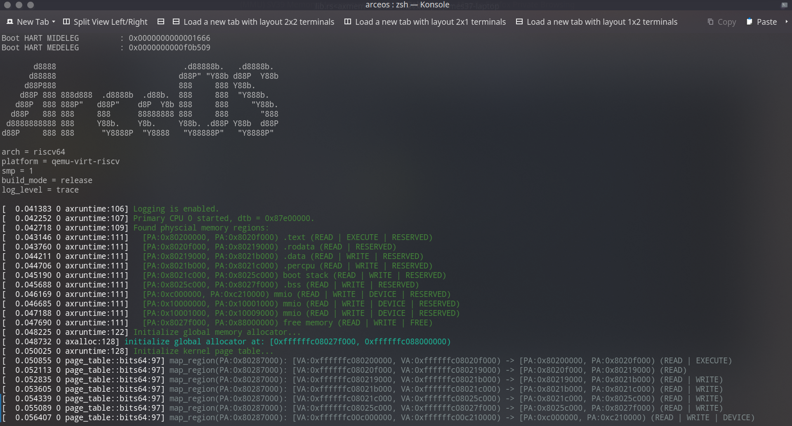
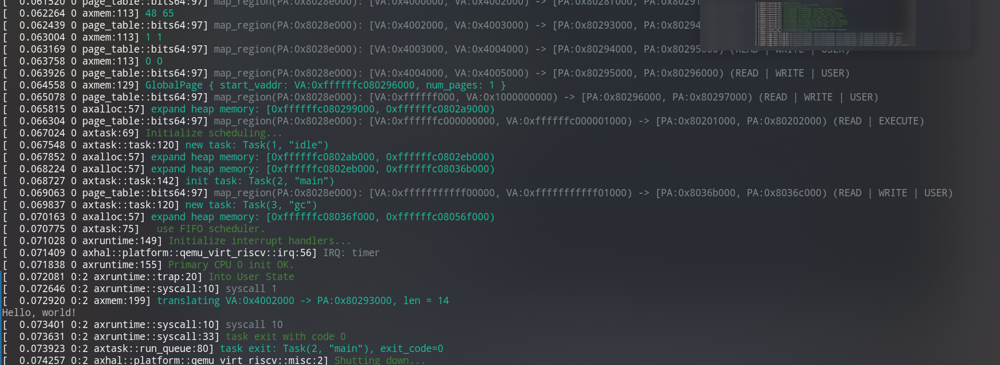

## 进展

+ (week7) 完成 U/S 切换
+ (week7) 对 libax 的重构，通过 syscall 调用原有函数（`write` + `exit`）
+ (week7) 分离内核和用户程序，并尝试独立编译，为隔离用户内存空间准备

+ 完成完整页表（elf 加载，按段映射，双页表机制）
  - 实现了 elf 加载，并将相关接口封装成了 crate
  - 类似于 rCore 的 MemorySet，定义了按照段分配的地址空间
  - 实现了单页表(kernel/user 共用页表) 和双页表 (分离)
    + 需要重新设计 trap_handler，实现页表的切换
  - 由于目前没有进程概念，因此用户空间只有一张页表
    + 相关功能实现在 `axmem` 模块中
+ 尝试将已有工作整合 `axtask`，实现单用户线程运行。
  - 需要为每个任务都提供 TrapFrame
  - 由于依赖关系限制，`axhal` 无法直接获取当前任务，需要用 `crate_interface` 中的功能。
  - 似乎有些 kernel only 的线程（如 gc 任务），未来实现多任务的时候可能需要注意
+ 对标 rCore ch4 实现

+ 初步了解 seL4, zCore(zircon) 的设计思想
+ 阅读 redox IPC 部分代码，分析其架构

## 下一步进展

+ 完善 `axtask`，实现多任务执行（线程/进程）
+ 开始实现 IPC 
+ 架构？

