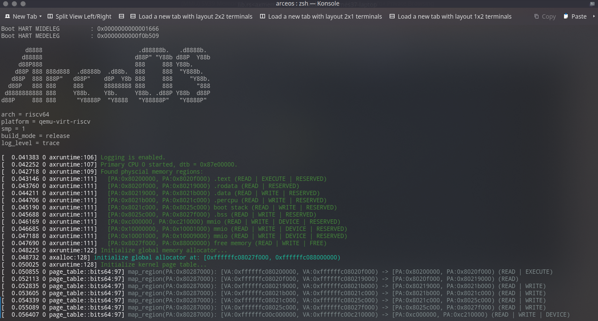
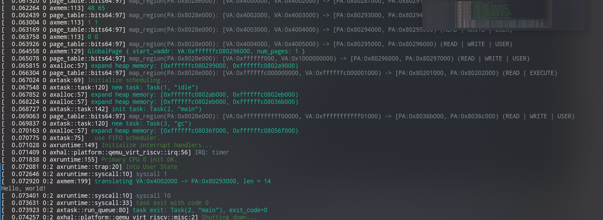

## 进展

+ (week7) 完成 U/S 切换
+ (week7) 对 libax 的重构，通过 syscall 调用原有函数（`write` + `exit`）
+ (week7) 分离内核和用户程序，并尝试独立编译，为隔离用户内存空间准备

+ 完成完整页表（elf 加载，按段映射，双页表机制）
+ 尝试将已有工作整合 `axtask`，实现单用户线程运行。

+ 初步了解 seL4, zCore(zircon) 的设计思想
+ 阅读 redox IPC 部分代码，分析其架构

## 下一步进展

+ 完善 `axtask`，实现多任务执行（线程/进程）
+ 开始实现 IPC 
+ 架构？

